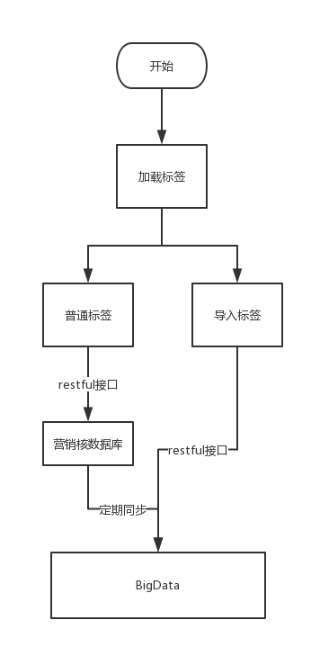

## 和大数据交互接口
#### 一：老的需求和交互方式
> 老需求如下
1.查询所有标签
2.根据标签(包括导入标签)查询预估人数
3.根据标签(包括导入标签)查询人员信息
4.查询所有导入标签

主意:老需求不涉及业务方

> 交互方式如下：

- 1、查询标签

- 2、查询预估人数

- 3、根据标签查询人员详细信息接口

- 4、查询导入标签

#### 二、新需求
> 老需求如下
1.查询所有标签
2.根据标签(包括导入标签)查询预估人数
3.根据标签(包括导入标签)查询人员信息
4.查询所有导入标签
5.查询所有业务方
6.查询某一个业务方

- 1、查询业务方

#### 三、需要解决问题
> 无论使用新版本还是老版本接口,都要需要支持一下功能

- 1、支持导入标签查询人员信息
- 2、同时支持新的标签和老的标签